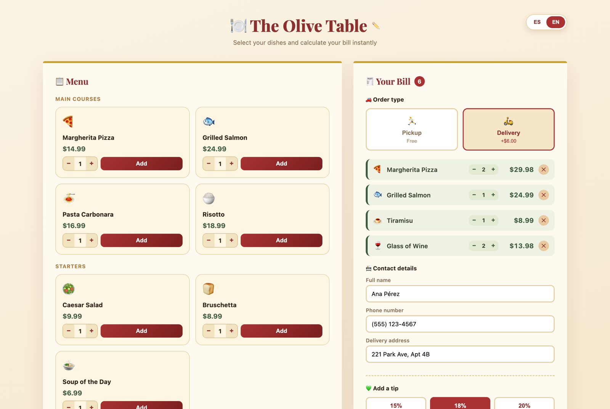

# 🍽️ Apron

An ordering page any restaurant can make its own in seconds: type the restaurant's name and it's ready, with a sample menu to order from.

**[▶ Try it live](https://gabodelgado.github.io/portfolio/Apron/)**

## What it does

- **Setup:** type the restaurant's name and the page is personalized. You can rename it anytime with ✏️.
- **Menu:** 12 dishes in 4 categories. Pick a quantity before adding a dish, then adjust or remove it from the bill.
- **Pickup or delivery:** delivery adds a $6.00 fee and asks for an address.
- **Tip:** choose 15%, 18% or 20%, or type an exact amount.
- **Sales tax:** you enter the real rate for your city. The app never guesses a tax rate, because it varies by location.
- **Checkout:** name, phone and address are validated before the order goes through. The confirmation shows an order number, an estimated time and how the total adds up (subtotal, tax, delivery, tip).
- **Nothing gets lost:** the order in progress is saved in the browser, so a reload picks up where you left off.
- **Two languages:** Spanish and English, with numbers written the way each one expects (`$1.234,56` / `$1,234.56`). Number fields add thousands separators as you type and understand pasted amounts in either format.

## Built with

Plain HTML, CSS and JavaScript, with no frameworks or build step. The only external resource is the Playfair Display font from Google Fonts.

## Run it

Open `index.html` in a browser.
