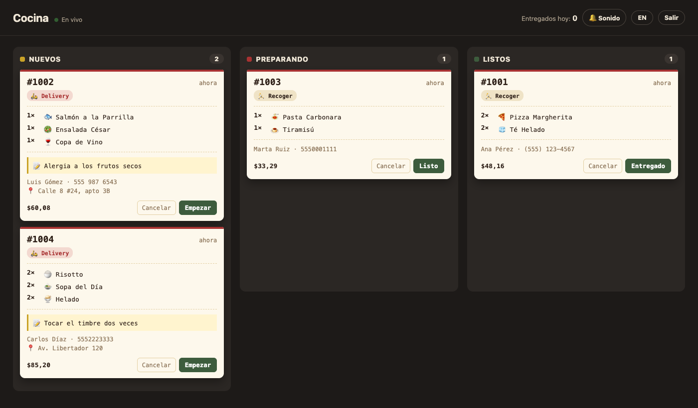

# 👩‍🍳 Kitchen

The backend for [Apron](../Apron/): a Python API that receives Apron's orders, stores them in a database, and shows them on a live kitchen board where staff move each order from new → preparing → ready → handed over.



## What it does

- **Totals computed on the server:** Apron sends only dish ids and quantities. The server prices everything from its own menu, in whole cents, so nobody can send a $0.01 pizza.
- **Careful validation:** unknown dishes, empty carts, short phone numbers, delivery without an address, tax rates over 100% and malformed tips are all rejected with a clear message.
- **A board for the kitchen:** tickets drop in live with a chime, notes and allergies are highlighted, late orders turn red, and orders can only move forward (or be cancelled before they're handed over).
- **Protected:** the board and status changes need the kitchen password. Placing orders is open, but limited to 10 per minute per device to stop floods.
- **Works with or without it:** Apron's public demo runs on its own. Point it at a Kitchen server with `?kitchen=<server-url>` and orders go to the real board instead.

## Built with

Python, [FastAPI](https://fastapi.tiangolo.com) and SQLite (from the standard library, no ORM). The board is plain HTML, CSS and JavaScript served by the same app. Interactive API docs are at `/docs`.

## API

| Method | Path | Who | What |
|---|---|---|---|
| `GET` | `/api/menu` | anyone | the menu with prices |
| `POST` | `/api/orders` | anyone | place an order; returns the priced order and its number |
| `GET` | `/api/orders?status=` | kitchen | list orders, newest first |
| `PATCH` | `/api/orders/{id}` | kitchen | move an order to its next status |

Kitchen endpoints need `Authorization: Bearer <KITCHEN_TOKEN>`.

## Run it

From the repository root:

```bash
pip install -r Kitchen/requirements.txt
KITCHEN_TOKEN=choose-a-password uvicorn Kitchen.app:app --reload
```

Open http://localhost:8000 for the board, and Apron with `?kitchen=http://localhost:8000` to send it orders.

Tests: `python -m pytest tests/test_kitchen.py` for the API, and `npx playwright test tests/kitchen.spec.js` for the full flow, from an order in Apron to the kitchen board.

## Deploy

`render.yaml` at the repository root deploys it to [Render](https://render.com) as a Blueprint, with a random kitchen password generated for you.
