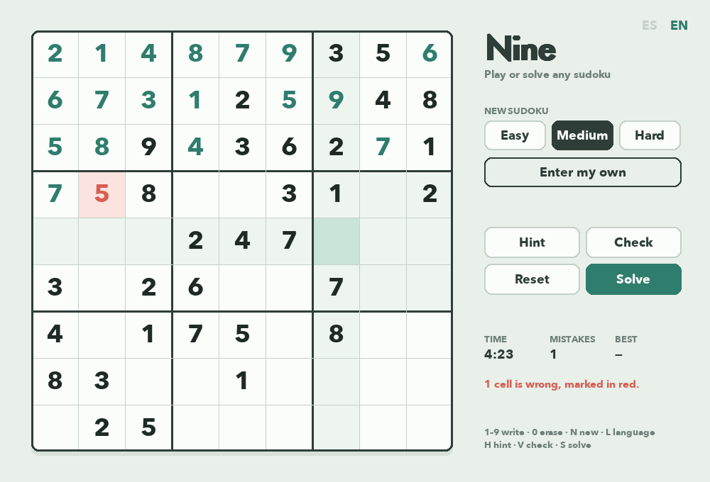

# 🔢 Nine

Play sudoku, or type in the one you're stuck on and watch it get solved.

**[▶ Play it in your browser](https://gabodelgado.github.io/portfolio/Nine/web/)**



## Highlights

- **Every puzzle has exactly one solution.** Nine starts from a random full grid and removes numbers in symmetric pairs, like a hand-made puzzle. After each removal it checks the puzzle still has a unique solution. Easy leaves about 40 clues, Medium 32 and Hard 26.
- **A fast solver:** it tracks which digits are still possible in each row, column and box using bit masks, and always tries the most constrained cell first. Even hard puzzles solve instantly.
- **Watch it think:** press Solve and the backtracking search is animated as it places and removes numbers. It starts slow enough to follow and speeds up on long searches.
- **Bring your own puzzle:** type any sudoku and Nine checks it has enough clues and no repeats, then solves it. If the puzzle has more than one solution, Nine tells you.
- **Play mode:** timer, mistake counter, hints, a check that marks wrong cells, and a best time for each difficulty. A game where you used hints doesn't count as a record.
- **Two languages:** Spanish and English.

## Controls

| Key | Action |
|---|---|
| Mouse / arrows | Select a cell |
| 1–9 | Write a number |
| 0 / Backspace | Erase |
| H | Hint |
| V | Check |
| S | Solve (Space finishes the animation) |
| N | New puzzle |
| L | Switch language |

## Run it

From the repository's root folder:

```bash
pip install -r requirements.txt
python Nine/main.py
```

## Browser version

[`web/`](web/) holds a JavaScript port so the game can be played without installing anything. It follows the Python version's rules, colors and tuning, and is drawn with HTML, with an on-screen number pad on phones. Records are kept in the browser.
