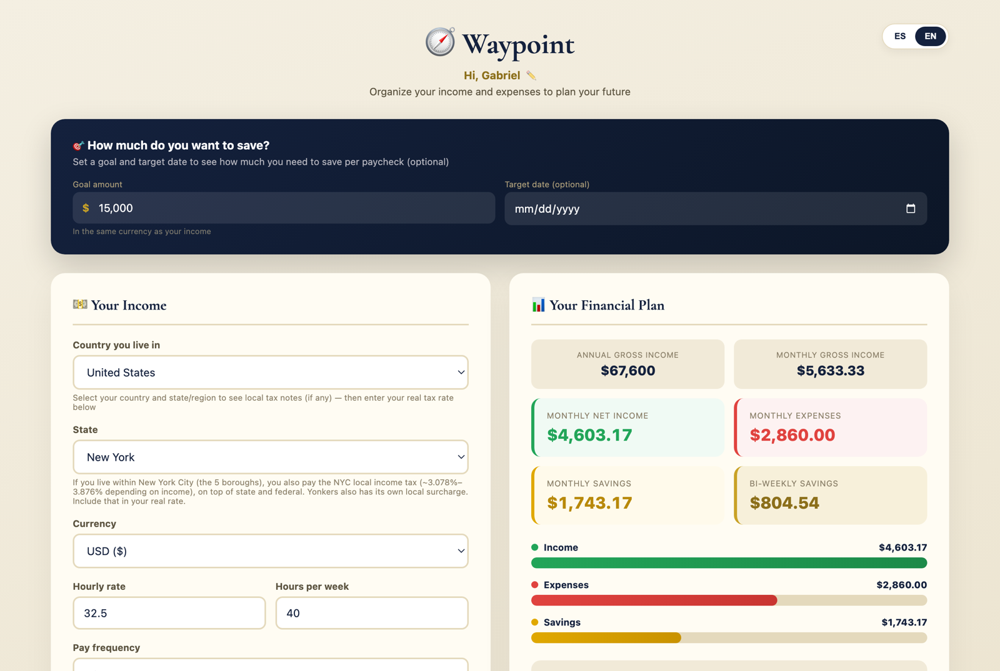
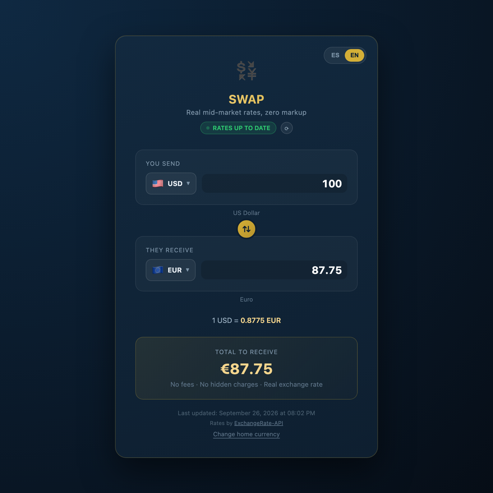
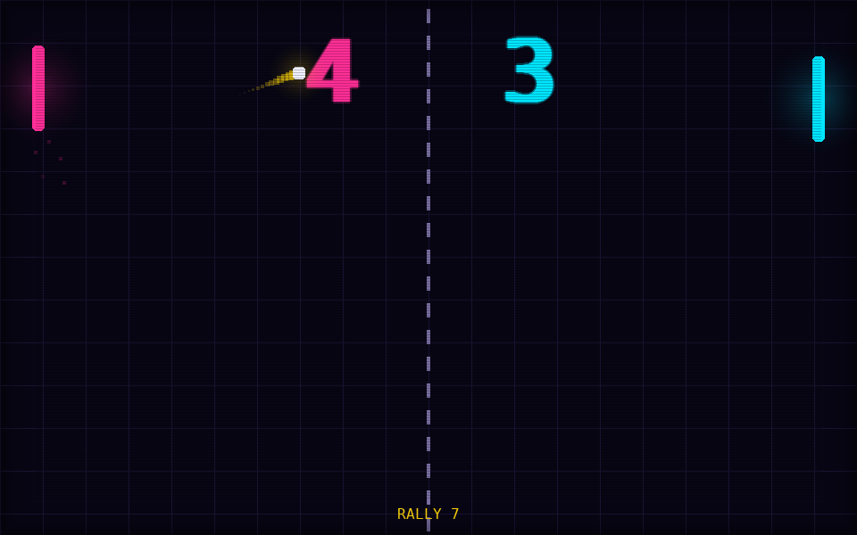
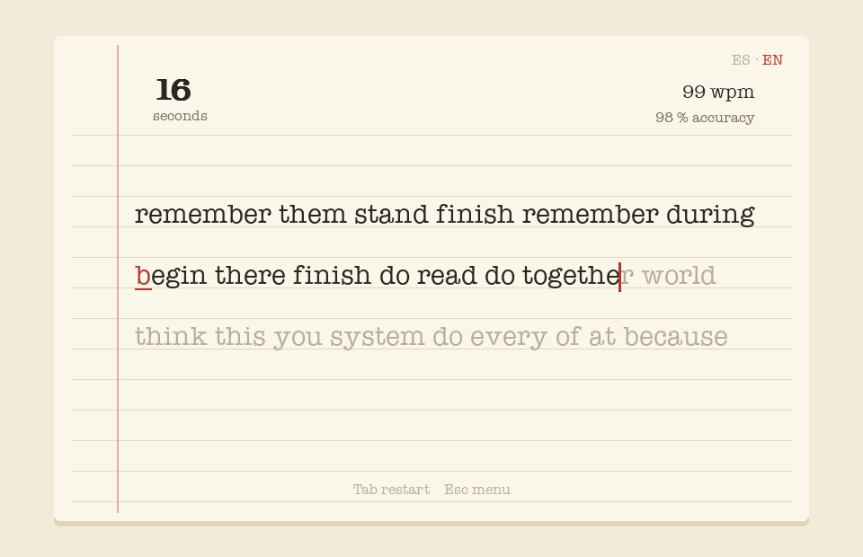

# Gabriel Delgado — Portfolio

Six small, finished projects: three web apps written in plain HTML, CSS and JavaScript, and three desktop games in Python. Each one has its own look and personality, runs in Spanish and English, and formats numbers the way each language expects (`1.234,56` / `1,234.56`).

## Web apps

| | |
|---|---|
| [](Apron/) | **[Apron](Apron/)** · [▶ Live demo](https://gabodelgado.github.io/portfolio/Apron/) — An ordering page for a restaurant. Name your restaurant, build an order from the menu, choose pickup or delivery, add a tip and your local sales tax, and get a confirmation with the full breakdown. |
| [](Waypoint/) | **[Waypoint](Waypoint/)** · [▶ Live demo](https://gabodelgado.github.io/portfolio/Waypoint/) — A personal finance planner. Enter your pay, taxes and monthly expenses to see what you can save per paycheck, and how long a savings goal will take. |
| [](Swap/) | **[Swap](Swap/)** · [▶ Live demo](https://gabodelgado.github.io/portfolio/Swap/) — A currency converter for 88 currencies, using real exchange rates. It keeps working offline with the last rates it downloaded and never invents a rate. |

## Python games

| | |
|---|---|
| [](Volley/) | **[Volley](Volley/)** — Neon arcade Pong against a CPU with three difficulty levels, or against a friend on the same keyboard. |
| [](Keystroke/) | **[Keystroke](Keystroke/)** — A typing speed test with a typewriter feel. Measures words per minute and accuracy, and keeps your best runs. |
| [](Nine/) | **[Nine](Nine/)** — Play sudoku, or type in any puzzle and watch the solver work it out step by step. |

## Running them

**Web apps:** try them live with the links above, or open the app's `index.html` in any modern browser. There's nothing to install or build.

**Games:** you need Python 3.9 or newer.

```bash
python3 -m venv .venv
source .venv/bin/activate
pip install -r requirements.txt
python Volley/main.py      # or Keystroke/main.py, Nine/main.py
```
