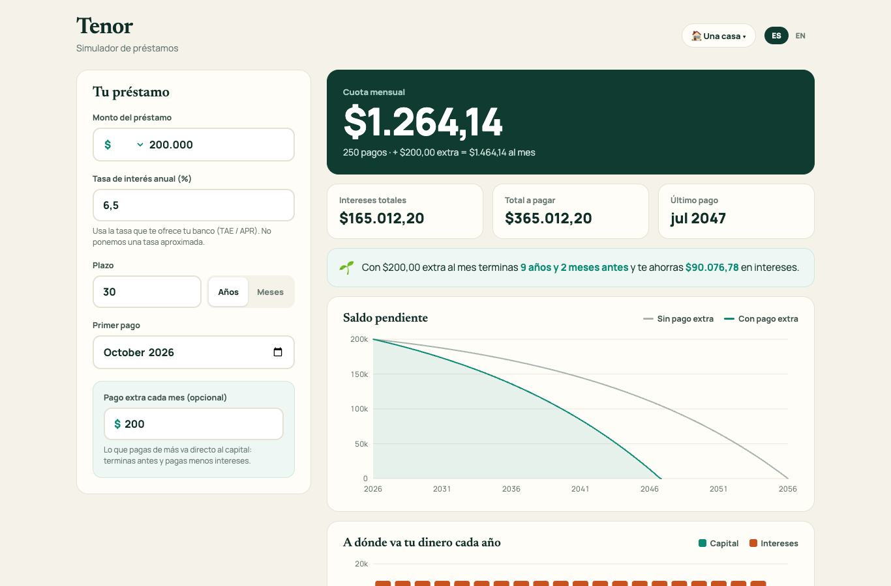

# 🏦 Tenor

A loan simulator for a home, a car, school or a personal loan: see the monthly payment, the total interest, the full amortization schedule, and how much an extra monthly payment saves you.

**[▶ Try it live](https://gabodelgado.github.io/portfolio/Tenor/)**

## What it does

- **Standard fixed-payment math:** the payment for $200,000 at 6.5% over 30 years comes out at $1,264.14, the same as any bank's mortgage calculator. A 0% loan is simply split evenly.
- **Extra payments, made visible:** add an amount on top of each payment and Tenor shows how much sooner you finish and how much interest you save. With $200 extra on that mortgage: 9 years and 2 months sooner and $90,076.78 less interest.
- **Your rate, never a guess:** the interest rate is always typed in by you, from your bank's offer. There is no "typical" rate filled in for you.
- **Charts you can read:** the remaining balance over time (with and without the extra payment) and a year-by-year split between principal and interest. Hover or tap for exact values. The colors were checked for color-blind readers.
- **The whole schedule:** by year or month by month, and downloadable as a CSV any spreadsheet can open.
- **Remembers your plan and language.** Spanish and English, with numbers formatted the way each one expects.

## Built with

Plain HTML, CSS and JavaScript. The charts are hand-built SVG, with no chart library.

## Run it

Open `index.html` in a browser. Tests: `npx playwright test tests/tenor.spec.js` from the repository root.
